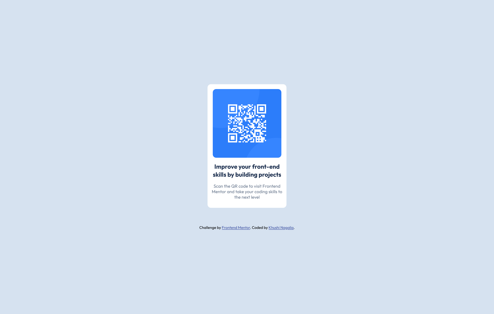
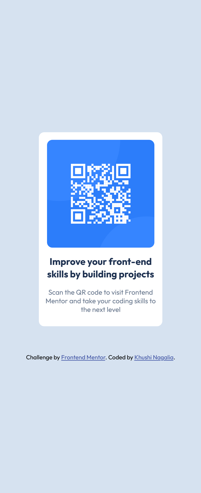

# Frontend Mentor - QR code component solution

This is a solution to the [QR code component challenge on Frontend Mentor](https://www.frontendmentor.io/challenges/qr-code-component-iux_sIO_H). Frontend Mentor challenges help you improve your coding skills by building realistic projects. 

## Table of contents

- [Overview](#overview)
  - [Screenshot](#screenshot)
  - [Links](#links)
- [My process](#my-process)
  - [Built with](#built-with)
  - [What I learned](#what-i-learned)
  - [Continued development](#continued-development)
  - [Useful resources](#useful-resources)
- [Author](#author)


## Overview

### Screenshot


In the above i added the screenshot of desktop design and in the below one is the mobile design



### Links

- Solution URL: [Add solution URL here](https://your-solution-url.com)
- Live Site URL: [Add live site URL here](https://your-live-site-url.com)

## My process

### Built with

- Semantic HTML5 markup
- CSS custom properties
- Flexbox


### What I learned

### 1. Flexbox  
Flexbox helped me easily center the QR code component within the viewport. By using `display: flex` on the parent element (the `body` tag), I could align and justify items both vertically and horizontally:  

```css  
body {
  display: flex;
  justify-content: center;
  align-items: center;
  height: 100vh; /* Full viewport height */
  margin: 0;
}
```

### 2. Rem unit
change the root font size in the future (e.g., for accessibility or responsive adjustments), the entire layout will adapt proportionally.

### 3. Centring the items
In the process of styling this i learn how to place the card in center of the screen. Firstly i find it very difficult to place it so i search about so many ways then i use this way:

```css
body{
    display: flex;
    justify-content: center;
    align-items: center;
    margin: 0;
    flex-direction: column;
    height: 100vh;
    gap: 50px;
}
```
I use the flex box to place the card in center..
I learn so  many other things also


### Continued development

While working on this project, I realized there are some areas where I can continue to grow and improve:  
I want to enhance my understanding of responsive design principles to create layouts that adapt seamlessly to different screen sizes and devices. Specifically:  
- **Media Queries**: Learning to use media queries effectively for styling elements based on screen size.  

I want to focus on understanding the right approach to styling elements for maintainability and scalability:

-Using modular CSS or utility classes for reusability.
-Structuring CSS to keep it organized and readable.
-Exploring tools like CSS Grid for complex layouts.


### Useful resources

- [Example resource 1](https://developer.mozilla.org/en-US/docs/Web/CSS/CSS_flexible_box_layout/Basic_concepts_of_flexbox) - This helped me for understanding the flex box. I really liked this pattern and will use it going forward.


## Author

- Frontend Mentor - [@khushi1638](https://www.frontendmentor.io/profile/khushi1)
- Twitter - [@learnwithkhushi](https://www.twitter.com/learnwithkhushi)


